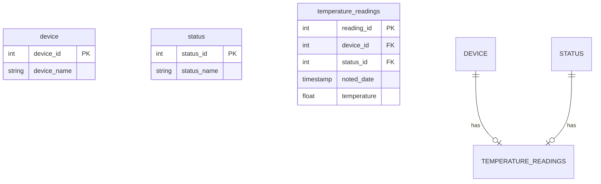

Датасет для анализа:
https://www.kaggle.com/datasets/atulanandjha/temperature-readings-iot-devices

Цель:
1) Разбить данные для загрузки в PostgreSQL, используя схему снежинка.
2) Вычислить 5 самых жарких и самых холодных дней за год.
3) Отфильтровать in/out = in.
4) Поле noted_date перевести в формат ‘yyyy-MM-dd’ с типом данных date.
5) Очистить температуру по 5-му и 95-му процентилю.

Данные из датасета поступают в таком виде:

| id                                      | room_id/id   | noted_date         | temp | out/in |
|-----------------------------------------|--------------|--------------------|------|--------|
| __export__.temp_log_196134_bd201015     | Room Admin   | 08-12-2018 09:30   | 29   | In     |
| __export__.temp_log_196131_7bca51bc     | Room Admin   | 08-12-2018 09:30   | 29   | In     |
| __export__.temp_log_196127_522915e3     | Room Admin   | 08-12-2018 09:29   | 41   | Out    |
| __export__.temp_log_196128_be0919cf     | Room Admin   | 08-12-2018 09:29   | 41   | Out    |
| __export__.temp_log_196126_d30b72fb     | Room Admin   | 08-12-2018 09:29   | 31   | In     |
| __export__.temp_log_196125_b0fa0b41     | Room Admin   | 08-12-2018 09:29   | 31   | In     |

Используя Airflow, выгрузим наши данные на локальный компьютер и проведем первичный анализ.

После того как наши данные будут преобразованы, спроектируем схему звезда и переместим их в PostgreSQL.

 
#### IoT Temperature Monitoring Schema

Внутри файла /etl_02/postgres_dockerfile/create_db.sql лежит скрипт для разворачивания схемы.




#### Kaggle

Для того, чтобы получить доступ к скачиванию в kaggle, необходимо получить API-токен и вставить внутрь файла
/etl_02/airflow_dockerfile/kaggle/kaggle.json

Данный файл имеет следующую структуру:

```
{
  "username": "nick_name",
  "key": "your_api_key"
}
```

#### Airflow
Внутри процесса скачивания имеется 3 DAG'a, один из них скачивает информацию о IOT устройствах, а другой проводит очистку информации,приведению информации к нужным типам, вывод небольшой 
статистики по температуре и подготовку данных к загрузке в PostgreSQL. 

DAG'и имеют следующую структуру: 

1) download_iot
При помощи данного DAG происходит загрузка нашего дата-сета, посредством взаимодействия с kaggle-API.


2) parse_iot
При помощи данного DAG происходит проверка, что файл скачан. После происходит очистка данных, сортировка и вывод требуемых значений.


Таже внутри таски log_info можно узнать статистику по самым теплым и самым холодным дням


3) load_postgres

Данный DAG производит полную загрузку за счет параметра(if_exists='replace'):
df.to_sql(table_name, hook.get_sqlalchemy_engine(), if_exists='replace', index=False)


Также был создан connection для работы с postrgesql. Можно проверить доступ зайдя на webserver и выполнить комманду для подуключения:
```
psql -U postgres -h etl_02-postgres_storage_db-1 -d postgres -p 5432 (пароль postgres)

```

#### Настройка connection
Admin -> Connection
```
Connection Id: postgres-db
Connection Type: Postgres
Host: etl_02-postgres-storage-db-1
Database: postgres
Login: postgres
Password: postgres
Port: 5432
```


Полная загрузка происходит в таблицу raw_data, можно посмотреть наши данные
```
postgres=# select * from raw_data ;

       id        | room_id/id |     noted_date      | temp | out/in 
-----------------+------------+---------------------+------+--------
 196134_bd201015 | Room Admin | 2018-12-08 00:00:00 |   29 | In
 196131_7bca51bc | Room Admin | 2018-12-08 00:00:00 |   29 | In
 196127_522915e3 | Room Admin | 2018-12-08 00:00:00 |   41 | Out
 196128_be0919cf | Room Admin | 2018-12-08 00:00:00 |   41 | Out
 196126_d30b72fb | Room Admin | 2018-12-08 00:00:00 |   31 | In
 196125_b0fa0b41 | Room Admin | 2018-12-08 00:00:00 |   31 | In
 196121_01544d45 | Room Admin | 2018-12-08 00:00:00 |   29 | In
 196122_f8b80a9f | Room Admin | 2018-12-08 00:00:00 |   29 | In
 196111_6b7a0848 | Room Admin | 2018-12-08 00:00:00 |   29 | In
 196112_e134aebd | Room Admin | 2018-12-08 00:00:00 |   29 | In

```

