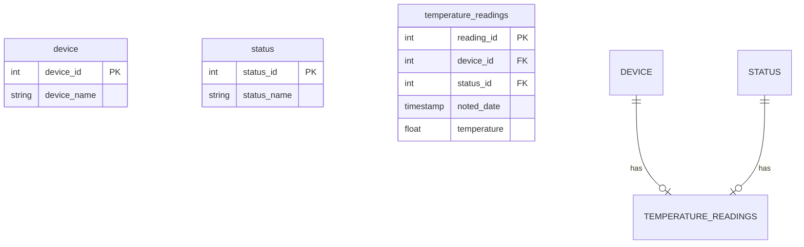

Датасет для анализа:
https://www.kaggle.com/datasets/atulanandjha/temperature-readings-iot-devices

Цель:
1) Разбить данные для загрузки в PostgreSQL, используя схему снежинка.
2) Вычислить 5 самых жарких и самых холодных дней за год.
3) Отфильтровать in/out = in.
4) Поле noted_date перевести в формат ‘yyyy-MM-dd’ с типом данных date.
5) Очистить температуру по 5-му и 95-му процентилю.

Данные из датасета поступают в таком виде:

| id                                      | room_id/id   | noted_date         | temp | out/in |
|-----------------------------------------|--------------|--------------------|------|--------|
| __export__.temp_log_196134_bd201015     | Room Admin   | 08-12-2018 09:30   | 29   | In     |
| __export__.temp_log_196131_7bca51bc     | Room Admin   | 08-12-2018 09:30   | 29   | In     |
| __export__.temp_log_196127_522915e3     | Room Admin   | 08-12-2018 09:29   | 41   | Out    |
| __export__.temp_log_196128_be0919cf     | Room Admin   | 08-12-2018 09:29   | 41   | Out    |
| __export__.temp_log_196126_d30b72fb     | Room Admin   | 08-12-2018 09:29   | 31   | In     |
| __export__.temp_log_196125_b0fa0b41     | Room Admin   | 08-12-2018 09:29   | 31   | In     |

Используя Airflow, выгрузим наши данные на локальный компьютер и проведем первичный анализ.

После того как наши данные будут преобразованы, спроектируем схему звезда и переместим их в PostgreSQL.

 
#### IoT Temperature Monitoring Schema

Внутри файла /etl_02/postgres_dockerfile/create_db.sql лежит скрипт для разворачивания схемы.




#### Kaggle

Для того, чтобы получить доступ к скачиванию в kaggle, необходимо получить API-токен и вставить внутрь файла
/etl_02/airflow_dockerfile/kaggle/kaggle.json

Данный файл имеет следующую структуру:

```
{
  "username": "nick_name",
  "key": "your_api_key"
}
```

#### Airflow
Внутри процесса скачивания имеется 3 DAG'a, один из них скачивает информацию о IOT устройствах, а другой проводит очистку информации,приведению информации к нужным типам, вывод небольшой 
статистики по температуре и подготовку данных к загрузке в PostgreSQL. 

DAG'и имеют следующую структуру: 

1) download_iot
При помощи данного DAG происходит загрузка нашего дата-сета, посредством взаимодействия с kaggle-API.


2) parse_iot
При помощи данного DAG происходит проверка, что файл скачан. После происходит очистка данных, сортировка и вывод требуемых значений.

[img-2]

3) load_postgres


[img_1]

[img_2]


